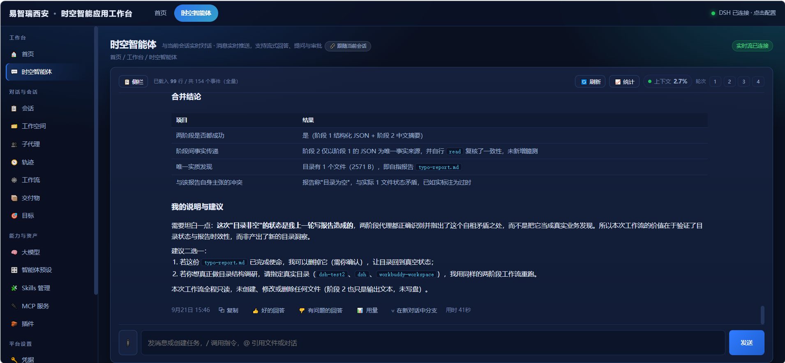
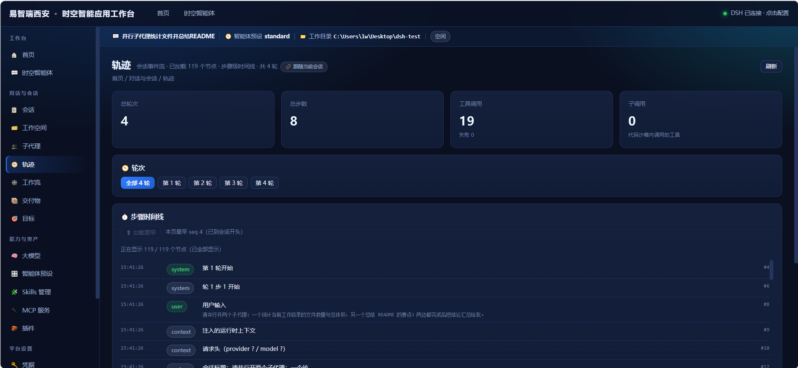
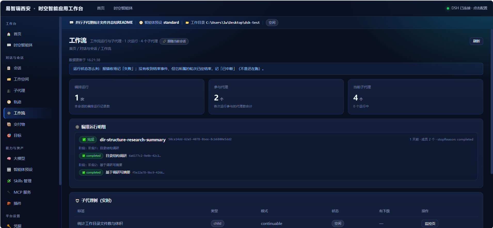
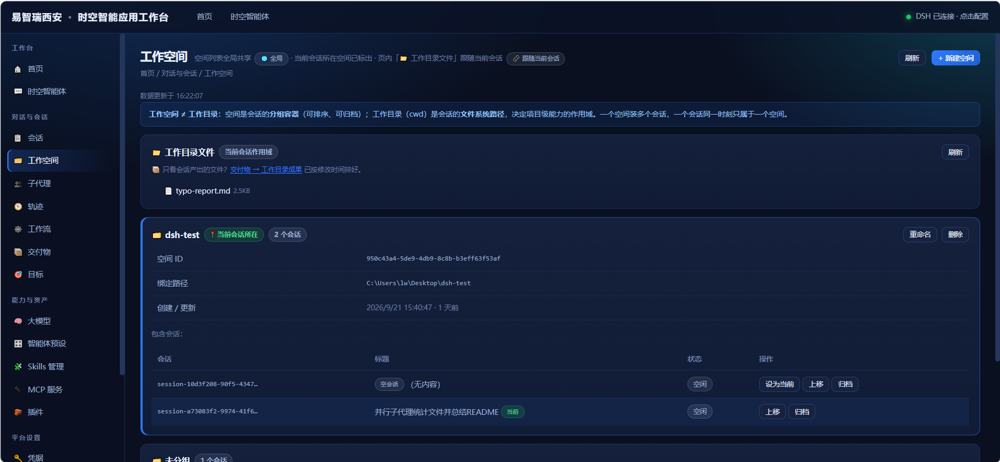
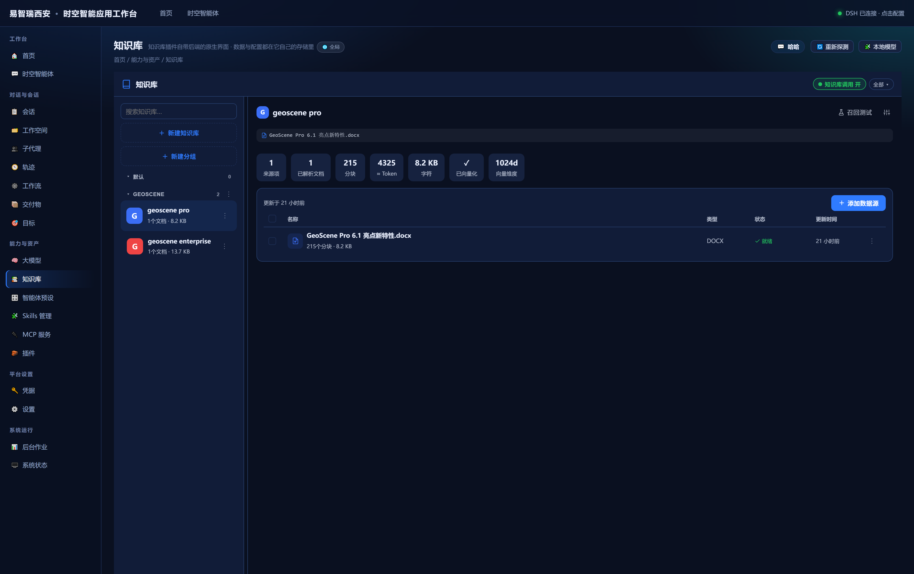

# DSH Console · 易智瑞西安时空智能应用工作台

[](https://github.com/gischina/dsh-console/actions/workflows/ci.yml)
[](LICENSE)
[](CHANGELOG.md)
[](https://nodejs.org)
[](#)

**DSH Console 是一个 DSH 控制台**，把 DSH 的会话、技能、知识库、MCP、插件、模型、设置、
凭据、子代理等能力做成一个本地网页，打开 `http://127.0.0.1:3081` 即可操作，
并**内置对接 GeoScene Pro MCP 服务端**——GeoScene Pro 起来后，对话里就能直接调用它的 31 个工具，
覆盖从加载数据、读写图层属性，到符号化与标注、属性与空间关系查询、视图缩放、工程存档与出图，
再到执行 GP 工具的整条链路。
**它不是替代 DSH，而是 DSH 的增强**：控制台自己不存数据，页面上的内容全部来自 DSH 的实时接口。

搭建一个时空智能体应用的过程也收进了同一页：不必再在终端、配置文件和多份文档之间来回切换，
能力、配置与运行状态都看得见、改得动，整个过程更省事。

---






## 目录

- [内置 GeoScene Pro MCP 对接](#内置-geoscene-pro-mcp-对接)
- [知识库（dsh-knowledge 插件）](#知识库dsh-knowledge-插件)
- [1. 架构与依赖关系](#1-架构与依赖关系)
- [2. 环境要求](#2-环境要求)
- [3. 快速启动（两步）](#3-快速启动两步)
- [3.5 部署到其他机器（给别人用）](#35-部署到其他机器给别人用)
- [4. 环境变量](#4-环境变量)
- [5. 目录结构](#5-目录结构)
- [6. 功能页面](#6-功能页面)
  - [全量回归](#全量回归)
- [7. 控制台自有接口](#7-控制台自有接口)
- [8. 数据来源原则](#8-数据来源原则)
- [9. 停止与重启](#9-停止与重启)
- [10. 故障排查](#10-故障排查)
- [11. 已知限制](#11-已知限制)
- [12. 排障顺序](#12-排障顺序)

---

## 内置 GeoScene Pro MCP 对接

控制台面向 GeoScene Pro 做了内置对接：控制台侧不需要写任何配置，它按固定约定
（`StartGeoSceneMcp` 启动、`127.0.0.1:11000` 通信）直接把 GeoScene Pro 当作本机的 MCP 服务端来用。

**控制台侧（自动，无需配置）**

- TCP 探测 `127.0.0.1:11000`
- 探到端口后发起真实的 `initialize` / `tools/list` 握手，数出实际可用工具数
- 握手成功即回写快照 `mcp-tools.json`；失败时回退上一次成功的结果，并在页面上标明来源，**不假装在线**

**DSH 侧（一次性配置）**

要让智能体真正能调用这些工具，需要在 `~/.dsh/profiles/<profile>/cordis.patch.yml` 里
加载 `mcp-geoscene` 客户端实例，改完**重启 `dsh web`**（该 profile 的 HMR 已关闭）。

握手通过后，智能体可调用的 GeoScene Pro 工具共 **31 个**：

| 分组 | 工具 |
|---|---|
| 图层与数据 | `get_all_layers_properties_json` · `get_layer_properties_by_name` · `modify_layer_properties` · `add_data` · `remove_layer_by_name` · `read_gdb_data` |
| 符号化与标注 | `render_point` · `render_line` · `render_polygon` · `render_by_lyrx` · `render_layer_by_unique_values` · `render_layer_by_graduated_color` · `label_layer` · `set_label_symbol_properties` · `hide_labels_by_layer_name` |
| 查询与选择 | `query_features_by_attribute` · `query_by_spatial_relation` · `filter_by_attribute` · `clear_selection_by_layer_name` · `query_and_zoom` |
| 视图与缩放 | `zoom_to_extent` · `zoom_to_layer_extent` · `zoom_to_selected_features` |
| 工程与出图 | `open_project` · `save_current_project` · `create_project_by_template` · `export_map_to_jpg` · `public_map` |
| GP 与状态 | `executegp` · `get_gp_history` · `is_busy` |

> 清单取自一次真实的 `initialize` + `tools/list` 握手结果，不是写死的常量；GeoScene Pro 版本
> 或服务端工具开关不同，实际数量会随之变化 ——「MCP 服务」页显示的是本机实测值。

---

## 知识库（dsh-knowledge 插件）

控制台对第三方知识库插件 **dsh-knowledge** 做了自适应集成：DSH 那边装了它，控制台侧不加任何配置，
就会多出「知识库」和「本地模型」两个页面；没装时这两个页面显示引导卡，其余功能不受影响。

**插件提供什么**（本项目不重复实现，只负责接进来）

- 知识库管理：建库 / 分组 / 从文件、目录、URL 或纯文本导入文档，解析分块，原文与分块预览，召回测试
- 向量与检索：OpenAI 兼容 / Ollama / 本地模型 / 关键词降级四种 embedding 模式，混合检索与回答前自动注入
- 模型可见工具：`knowledge_search` 等一组工具，智能体在对话里直接查知识库
- 本地模型管理：embedding / 重排 / OCR 模型的下载、重试与健康状态

**控制台做了什么**

- 两个页面：`#/knowledge`（侧栏「能力与资产」组）与 `#/knowledge/models`
  （不在侧栏；从知识库页右上角的「🧩 本地模型」按钮进入），
  以插件槽位装载**插件自带的界面**——控制台不维护第二份知识库界面
- `server.cjs` 铺一条 `/api/kb/* → /knowledge/*` 的等价通道：请求体原样转发、不设超时
  （导入目录树、重建索引是分钟级长任务，浏览器中途断开要把中止传下去）
- 插件界面代码**运行时从本机已装的插件里取**（`/api/kb-client.js`），不拷贝进本仓库——
  页面上跑的永远是你装的那一份，生产包也不随带插件的 AGPL 代码
- 插件界面需要 React：控制台内置一份**构建期抽取**的 React 运行时（`public/react/`，
  由 `tools/extract-react-runtime.mjs` 生成），不借用 DSH 的前端产物（那样会把 DSH 的界面整个带起来）

**前提（DSH 侧，一次性）**

```powershell
dsh plugin --profile web add dsh-knowledge
```

装完**重启 `dsh web`**。插件是否可用以「知识库」页顶部的实时探测为准；
没装时页面给出引导，不会假装可用。

---

## 1. 架构与依赖关系

```
┌──────────────────────────────┐
│  浏览器                       │
│  http://127.0.0.1:3081       │
└───────────┬──────────────────┘
            │  HTTP + WebSocket（同源，无跨域问题）
┌───────────▼──────────────────┐
│  dsh-console / server.cjs    │   ← 本项目（Node，无第三方依赖）
│  · 静态托管 public/           │
│  · /api/* 反向代理            │
│  · /api/remote.mux WS 桥接   │
│  · /api/local/* 本地接口      │
└───────────┬──────────────────┘
            │
┌───────────▼──────────────────┐        ┌─────────────────────────┐
│  DSH 主机                     │        │  本机文件系统 / 配置文件  │
│  http://127.0.0.1:3080       │        │  ~/.dsh/profiles/web/…  │
│  dsh web                     │        │  会话工作目录            │
└──────────────────────────────┘        └─────────────────────────┘
            │
            ▼
   GeoScene Pro（通过 MCP 桥接，127.0.0.1:11000）
```

**关键点：控制台不能单独运行。** 它必须有一个正在跑的 DSH 主机；DSH 没起来时首页会显示红条「无法连接 DSH 主机」。

---

## 2. 环境要求

| 项 | 要求 | 说明 |
|---|---|---|
| 操作系统 | Windows / macOS / Linux | 命令示例按 Windows 写；核心逻辑跨平台 |
| Node.js | **≥ 18** | `server.cjs` 用了全局 `fetch` 和 `node:` 前缀模块。已验证 v24.10.0 |
| DSH | 已安装且能跑 `dsh web` | 提供 3080 端口的数据源；**这是硬前提** |
| DSH 版本 | **0.1.5-rc.2**（开发与回归所基于的版本） | 控制台直连 DSH 的 Remote 端点，其他版本未测：端点或参数变更可能导致部分页面异常 |
| 第三方依赖 | **无** | 除 Node 内置模块外零依赖，不需要 `npm install` |
| 端口 | 3080（DSH）、3081（控制台） | 均可通过环境变量改 |

> **本项目没有 `package.json`，不需要 `npm install`，也不需要构建。**
> `public/` 目录里的东西就是最终前端产物；整个项目**只依赖 Node 内置模块**。

> **DSH 是什么、从哪来**：它是本控制台唯一的数据源，一个需要单独安装的命令行程序。
> 装好后在终端能跑 `dsh web` 就行；还没装的话，`npx @deepseek-ai/dsh web` 也能直接把它拉起来
> （见下一节）。**没有 DSH，所有页面都是空的** —— 所以本地动手验证之前，先把它准备好。

---

## 3. 快速启动（两步）

### 第一步 · 启动 DSH 主机

打开 **PowerShell**，执行：

```powershell
dsh web
```

看到它监听 `127.0.0.1:3080` 即可（这个窗口保持不关）。

> **如果 `dsh` 命令本身不存在**（例如你是用 `npx` 拉起来跑的），用这条等价命令：
> ```powershell
> npx @deepseek-ai/dsh web
> ```
> 这种部署下 `dsh` **不在系统 PATH 上**，只存在于 npx 缓存里。控制台会自己去 npx 缓存找它
> （自检的 `[6]` 会显示来源是 `PATH` 还是 `npx 缓存`），所以「插件」页的实时探测仍然可用。

> ⚠️ **必须在 PowerShell 里启动，不要在 Git Bash 里启动。**
> 原因：GeoScene Pro 的 MCP 批处理 `StartGeoSceneMcp.bat` 用 `tasklist | find /i "GeoScenePro.exe"` 判断 Pro 是否已启动。Git Bash 会把自带 Unix 版 `find.exe` 排在 `C:\Windows\System32\find.exe` 前面，导致判断逻辑失效、误报「Pro 未启动」并卡在 `pause`，MCP 会**静默接不上**（工具数为 0，且不报错）。

### 第二步 · 启动控制台

**最省事的方式：双击 `start.cmd`**（会自检 Node、切好 UTF-8 代码页、启动服务、退出时保留窗口看提示）。

或者另开一个 **PowerShell** 窗口：

```powershell
cd <dsh-console 所在目录>       # 就是含 server.cjs 的那个目录
node server.cjs
```

启动成功会打印（并自动探测 DSH 是否可达、是否已认证）：

```
DSH Console 已启动
  控制台地址 : http://127.0.0.1:3081
  代理目标   : http://127.0.0.1:3080
  实时流桥接 : ws://127.0.0.1:3081/api/remote.mux → http://127.0.0.1:3080

  目标来源   : 默认地址
  访问令牌   : 未配置（需要认证的 DSH 会要求）

✓ DSH 主机正常（http://127.0.0.1:3080，已认证）

浏览器打开 http://127.0.0.1:3081 即可（Ctrl+C 停止）
若首页提示需要配置 DSH：点右上角状态栏，把 dsh web 打印的地址整段填进去。
```

若 DSH 没起来（或需要令牌而没配），这里会直接说清楚 —— 不用等打开浏览器看红条：

```
× DSH 主机不可用：http://127.0.0.1:3080（HTTP 401）—— DSH 要求浏览器会话鉴权，请粘贴带 ?token=… 的地址
  DSH 的 Web 端口带会话鉴权：需要一个 `dsh web` 打印出来的带令牌地址。
  两种填法：
    ① 浏览器打开 http://127.0.0.1:3081 后，点右上角状态栏，在弹窗里粘贴
    ② set DSH_ORIGIN=http://127.0.0.1:3080/?token=<令牌> 后重启控制台
```

### 然后 · 打开浏览器（这一步不用敲命令）

访问 **http://127.0.0.1:3081**

### 快速自检

```powershell
# 两条都应输出 200
curl.exe -s -o NUL -w "DSH=%{http_code}\n"    http://127.0.0.1:3080/
curl.exe -s -o NUL -w "控制台=%{http_code}\n" http://127.0.0.1:3081/
```

---

## 3.5 部署到其他机器（给别人用）

**不需要打包、不需要构建、不需要 `npm install`** —— 整个项目只依赖 Node 内置模块。

### 先选场景：是「给人部署」还是「给人看源码」

| 场景 | 怎么做 | 产物 |
|---|---|---|
| **生产部署**（不给源码） | 双击 **`dist.cmd`**（等价于 `node tools/make-dist.mjs`） | `dist/dsh-console-<版本>/` + 同名 `.zip`：源码已压缩混淆，只含运行必需的文件 + LICENSE/NOTICE |
| 看源码 / 一起改 | git，或下面的 `robocopy` / `rsync` 命令 | 源码目录（**必须**排除本机状态文件） |

### A. 生产部署包（推荐）

```powershell
node tools/make-dist.mjs
```

**版本号**放在项目根的 **`VERSION`** 文件里（一行纯文本，如 `0.1.5-rc.2`）——
要发新版本就改这一个文件，再跑 `dist.cmd`；临时想打别的版本可加参数 `node tools/make-dist.mjs --version=0.1.5-rc.3`（不改 VERSION 文件）。

产物在**本项目目录下**的 `dist/`（每次运行先清空 `dist/` 再重建，目录和 zip 都带版本号）：

```
dist/dsh-console-<版本>/
  server.cjs               后端：静态托管 + 反向代理 + WS 桥 + 知识库通道（混淆）
  public/app.js            前端全部逻辑（混淆）
  public/index.html        页面骨架
  public/style.css         样式
  public/react/            内置 React 运行时（知识库插件界面依赖，构建期抽取）
  start.cmd                启动器
  check.cmd                部署自检
  README.md                部署说明（源在源码工程的 docs/deploy.md，顶部盖有版本号）
  LICENSE                  Apache-2.0 全文（再分发时必须随附）
  NOTICE                   归属声明（再分发时必须随附）
dist/dsh-console-<版本>.zip 同一个东西的压缩包（解压即得同名目录）
```

**不含**：`tools/`（回归脚本，导出函数名清单等于把内部结构交出去）、
`docs/`（包内那份 README 的源文件就是 `docs/deploy.md`，已经随包提供；其余是仓库自用的截图）、
`.gitignore`，以及任何本机运行状态文件（`dsh-config.json` / `plugins.json` / `mcp-tools.json` / `ui-prefs.yaml`）。

> **混淆的边界（重要，别误会）**：只做 `compress`（去注释 / 压空白 / 死代码消除）+ `mangle`（函数内局部变量名）。
> **故意不开顶层函数名混淆** —— 页面有 100+ 处 `onclick="fn()"` 按名调用顶层函数，顶层改名会让这些按钮
> 全部点不动（要开得先把交互层重构成事件委托，那是另一件事）。已实测对照：混淆前后 window 全局函数
> **集合逐一对上，零缺失零多出**，全部路由逐页渲染 + 点按钮均无异常。
> 所以产物的定位是**「不可读、不好改」，而不是「不可逆向」** —— JS 明文运行，没有真正的加密。

> 混淆器 terser 走 npx 调用，**只在打包时用**：不进项目依赖、不生成 `package.json`，产物运行时依然零依赖。
> 首次打包需要联网拉一次（之后走本机 npx 缓存）。加了 `--no-mangle` 可产出明文（仅内部对比用，别对外）。

### B. 源码分发（给开发者）

```
必须：  server.cjs   public/   start.cmd   check.cmd
建议：  README.md   docs/       # 部署与排障手册
可选：  tools/                 # 回归诊断脚本，不影响运行
不要：  plugins.json  mcp-tools.json  dsh-config.json  ui-prefs.yaml
        tools/endpoints.json     # 上面 5 个是「本机运行状态」，不是源码
        tools/*-out.txt          # 回归报告的产出，是本机实测记录
        .git/  node_modules/     # 前者是版本库，后者本项目根本不用
```

> `check.cmd` 别漏——下面和故障排查都让你先跑它做部署自检，少了它这一步就断了。
> `.gitignore` 已经把上面那几个运行状态文件挡在外面（如果对方用 git 拉代码的话）。

**源码里没有任何写死的绝对路径 / 用户名 / 机器相关目录**（实测扫描：用户名、npx 缓存哈希、
工作区目录名在 `.cjs` / `.js` / `.mjs` / `.html` / `.css` / `.cmd` 里 0 命中）。所有路径都按运行时信息推导：

| 用到的东西 | 怎么推导 |
|---|---|
| 自己的安装目录 | `__dirname` / `%~dp0`（两个 .cmd 都用 `cd /d "%~dp0"`） |
| 用户主目录 | `USERPROFILE` → `HOME` |
| npx 缓存 | `LOCALAPPDATA%\npm-cache\_npx`、`~/.npm/_npx`、`$npm_config_cache/_npx` |
| 全局 dsh | `PATH` → `node.exe` 同目录 → `%APPDATA%\npm` → `Program Files\nodejs` → `/usr/local/bin` → Homebrew → `~/.npm-global/bin` |
| DSH 地址 | `DSH_ORIGIN` → `dsh-config.json` → 默认 `127.0.0.1:3080` |
| 端口 | `CONSOLE_PORT`（默认 3081） |
| 临时文件 | `TMPDIR` / `TEMP` / `TMP` → `os.tmpdir()`（**不落进安装目录**） |

> **安装目录需要可写**：`plugins.json`、`mcp-tools.json`、`dsh-config.json`、`ui-prefs.yaml`
> 都写在 `server.cjs` 同层，靠页面改配置时由控制台自己回写。
> 写成只读目录也能跑（失败只记日志、不中断），但插件页会一直是 `error` 态、配置每次都要重填。

那两个探测快照是**运行它的那台机器**的结果：`plugins.json` 记着那台机器合成出来的插件树，
`mcp-tools.json` 记着那台机器握手到的 MCP 工具清单。写入前控制台会把**本机绝对路径压成末级文件名**
（`via` 里的 dsh 垫片路径、`layer` 里的补丁文件路径 → 只剩 `dsh.cmd` / `cordis.patch.yml`），
但现在这两份文件里仍有**本机的插件树与工具清单** —— 一起拷过去的话，对方一旦探测失败就会看到**你的**数据，
数据归属是错的。**所以不要带**：删掉即可，程序会自动重建。

`dsh-config.json` 更严格：它里面**记着你的 DSH 地址（以及访问令牌，如果有）**，拷过去等于把 DSH 的访问权一起给了别人，
而对方的地址本来也不一样。删掉即可，对方启动后弹窗里填自己的地址。

> **拷过去第一次启动会发生什么**（期望行为，不是故障）：
> 1. 自检 `[3]` 显示三个 `.json` 都不存在（正常）；
> 2. 自检 `[5]` 报「DSH 要求浏览器会话鉴权」——因为还没有配置过；
> 3. 浏览器打开控制台会**自动弹出配置窗**，把对方 `dsh web` 打印的地址整段粘进去即可；
> 4. 插件页第一次打开会走 `--dump-config` 实时探测并回写 `plugins.json`。

**一条命令生成干净源码拷贝**（省得手工挑，也不会漏掉配置里带的令牌）：

```powershell
# Windows：robocopy 退出码 0–7 都算成功，≥8 才是出错
robocopy . ..\dsh-console-src /E /XD node_modules .git dist /XF plugins.json mcp-tools.json dsh-config.json ui-prefs.yaml endpoints.json *-out.txt
```

```bash
# macOS / Linux
rsync -a --exclude node_modules --exclude .git --exclude dist \
      --exclude plugins.json --exclude mcp-tools.json \
      --exclude dsh-config.json --exclude ui-prefs.yaml --exclude endpoints.json \
      --exclude '*-out.txt' \
      ./ ../dsh-console-src/
```

**要不要打包？** 分两种场景：

- **生产部署**：`dist.cmd` 已经把带版本号的目录和 zip 都出好了（版本读根目录 `VERSION` 文件），直接把 zip 发出去即可。
- **源码分发**：不打包也能用 —— 没有构建、没有依赖，目录直接拷（U 盘 / 网盘 / 传文件夹）都行，
  `start.cmd` 用 `%~dp0` 定位自己，换盘符、换目录名都不影响。

> ⚠️ **不要直接压原目录**：`dsh-config.json` 里有你的 DSH 访问令牌，`plugins.json` /
> `mcp-tools.json` 里有你的插件树与 MCP 工具清单 —— 一起发出去等于把访问权和本机数据都给了对方。
> 上面两种方式生成的那一份才是能发出去的。

### 对方机器需要什么

| 项 | 要求 |
|---|---|
| Node.js | **≥ 18**（`node -v` 自查；不够时启动脚本会直接报错退出） |
| DSH | **已安装且正在运行**：`dsh web`（必须从 PowerShell 启动，理由见第 3 节的警告） |
| 环境变量 | DSH 不在默认地址时才需要设 `DSH_ORIGIN` |

### 先自检（推荐的第一步）

**双击 `check.cmd`**，或在命令行执行：

```powershell
node server.cjs --check
```

它**只检查、不启动服务**，逐项列出环境是否就绪，输出是纯文本，可以直接发给人排查：

```
[1] 运行环境          ✓ Node.js 版本 满足 ≥18
[2] 前端产物          ✓ public/index.html / app.js / style.css
[3] 本机状态文件      · plugins.json / mcp-tools.json / dsh-config.json（后两个含本机数据，别拷）
[4] 控制台端口        ✓ 可用 / 已被本程序占用 / 被别的程序占用
[5] DSH 主机          ✓ 是否可达、是否已认证、令牌来源、DSH 版本 + 运行实例构建号
[6] dsh 命令          ✓ 列出所有找到的 dsh（来源：当前 npx 进程树 / PATH / 全局目录 / npx 缓存）
[7] DSH profile       ✓ cordis.patch.yml 存在
[8] 打开方式          提示正确地址，别双击 index.html

结果：未发现阻塞问题。
```

标 `×` 的就是要处理的项；全 `✓` 而页面仍异常时，就会提示去 F12 → Network 看失败请求。

### 怎么跑

双击 `start.cmd`，或：

```powershell
cd <解压后的目录>
node server.cjs
```

启动时会**自检并把结果打印出来**，不用等打开浏览器看红条：

```
✓ DSH 主机正常（http://127.0.0.1:3080，已认证）
```

DSH 没起来（或需要令牌而没配）时是：

```
× DSH 主机不可用：http://127.0.0.1:3080（HTTP 401）—— DSH 要求浏览器会话鉴权，请粘贴带 ?token=… 的地址
  DSH 的 Web 端口带会话鉴权：需要一个 `dsh web` 打印出来的带令牌地址。
```

这时打开页面会**自动弹出配置窗**，把 `dsh web` 打印的地址整段粘进去即可（顶栏右上角状态栏也能随时打开）。

然后浏览器打开 **http://127.0.0.1:3081**。

### 关于 GeoScene

控制台对 GeoScene Pro 是**内置对接**：GeoScene Pro 在跑，MCP 服务页就是活的。
没装 GeoScene 的机器上，**控制台其余功能完全正常**，只有「MCP 服务」页显示离线/探测不到 —— 那是真实结果，不是故障。

---

## 4. 环境变量

在启动 `node server.cjs` 之前设置（当前 PowerShell 窗口内生效）：

| 变量 | 默认值 | 用途 |
|---|---|---|
| `CONSOLE_PORT` | `3081` | 控制台监听端口；被占用时改这里 |
| `DSH_ORIGIN` | `http://127.0.0.1:3080` | DSH 主机地址；**可以整段带上令牌**：`http://127.0.0.1:3080/?token=…`（也支持 `https://`） |
| `DSH_TOKEN` | 空 | 只给令牌、地址用默认或 `dsh-config.json` 里的值时用；与 `DSH_ORIGIN` 里的 `?token=` 等价 |
| `DSH_PROFILE` | `web` | 取插件树 / 读 MCP 补丁用的 profile 名 |
| `DSH_SESSION_CWD` | 当前进程目录 | `/api/local/skills` 未传 `cwd` 时的项目根回退值 |

> 地址与令牌的解析优先级：环境变量 > 同目录 `dsh-config.json`（页面上填的、连接成功才落盘）> 默认 3080。
> 环境变量优先级更高，方便"临时指到另一台 DSH"而不动已保存的配置。

示例：

```powershell
$env:CONSOLE_PORT = "9081"
# 把 dsh web 打印的整段地址贴进来（含令牌）
$env:DSH_ORIGIN   = "http://127.0.0.1:3080/?token=<令牌>"
node server.cjs
```

---

## 5. 目录结构

```
dsh-console/
├─ start.cmd             # Windows 双击启动器（自检 Node + 切 UTF-8 代码页 + 启动）
├─ check.cmd             # Windows 双击部署自检（等价于 node server.cjs --check）
├─ VERSION               # 版本号（一行纯文本，如 0.1.5-rc.2；dist.cmd 打包时读它命名产物）
├─ CHANGELOG.md          # 更新日志（Keep a Changelog 格式）
├─ LICENSE               # Apache License 2.0 全文
├─ NOTICE                # 归属与第三方说明（Apache-2.0 要求随分发保留）
├─ CONTRIBUTING.md       # 贡献指南（Issue / PR 约定、回归清单）
├─ SECURITY.md           # 安全漏洞报告通道（邮件，勿公开 Issue）
├─ CODE_OF_CONDUCT.md    # 社区行为准则（Contributor Covenant 2.1）
├─ .gitattributes        # 保住两个 .cmd 的 CRLF + 纯 ASCII（跨平台 git 检出不被改坏）
├─ .editorconfig         # 编辑器约定（.cmd 必须 CRLF；md 保留行尾空格）
├─ .github/
│  ├─ ISSUE_TEMPLATE/    # Issue 模板（bug 报告强制带自检输出；功能建议；config.yml 关空白 Issue 并引导安全漏洞走私密通道）
│  ├─ PULL_REQUEST_TEMPLATE.md  # PR 自查清单（零依赖铁律、回归项、.cmd 编码、app.js 铁律）
│  └─ workflows/
│     └─ ci.yml          # 持续集成：只跑不需要 DSH 就能判定的（语法 / 打包完整性 / 起服务烟测 / 入库守卫）
├─ dist.cmd              # Windows 双击生产打包（等价于 node tools/make-dist.mjs）
├─ server.cjs            # 唯一后端：静态托管 + 反向代理 + WS 桥 + 本地接口（零第三方依赖）
├─ public/
│  ├─ index.html         # 页面骨架（页头品牌、侧栏、内容区）
│  ├─ app.js             # 单页应用全部逻辑（路由 / 页面 / 对话 / API 翻译表 / 逻辑流）
│  ├─ style.css          # 深色科技风主题 + 浅色主题变量（含长内容/窄屏加固）
│  └─ react/             # 构建期抽取的 React 运行时（知识库插件界面依赖；tools/extract-react-runtime.mjs 生成）
├─ plugins.json          # 插件树快照（dump 失败时兜底；每次 dump 成功自动回写）※ 本机数据
├─ mcp-tools.json        # MCP 工具清单快照（握手失败时兜底；每次握手成功自动回写）※ 本机数据
├─ dsh-config.json       # DSH 地址 + 访问令牌（页面「配置 DSH 主机」写入）※ 含密钥，勿分发
├─ ui-prefs.yaml         # 控制台界面偏好（各页说明卡显隐等）※ 本机偏好，勿分发
├─ docs/
│  ├─ deploy.md          # 部署说明（打包时拷成产物里的 README.md，是对方唯一需要的文档）
│  └─ images/            # README 用的界面截图（随仓库走相对路径，不依赖图床）
├─ tools/                # 运维 / 排查用的小工具（不参与运行，可整体不拷）
│  ├─ test-api.mjs       # 端到端回归：端点映射 + 参数形状 + 页面渲染 + 接线审计 + 重绘防回归
│  ├─ render-all.mjs     # 渲染回归：全部页面骨架 + 说明卡 + 加载器状态机 + 消息操作条 + Markdown 渲染
│  ├─ page-audit.mjs     # 静态审计：跨页一致性 / 接线 / 死链 / 文案，外加端点只读探测
│  ├─ sandbox-render.mjs # 沙箱渲染：把 app.js 载进 vm 打桩渲染，查运行时异常与凭据兜底
│  ├─ cdp-chat-check.mjs # 真机核验：Edge headless + CDP 量对话页渲染结构与轮次跳转（需 Windows + Edge）
│  ├─ make-dist.mjs      # 生产打包：读 VERSION 命名产物 + 混淆 + 排除本机状态文件 + 收尾扫令牌与本机路径
│  ├─ extract-react-runtime.mjs # 从 DSH 前端产物抽取 React 运行时到 public/react/（带自检；DSH 更新后重跑）
│  ├─ verify-react-runtime.mjs  # 校验抽取出的 React 运行时可用（断言清单，全绿才算数）
│  ├─ shot-page.mjs      # 文档截图：Edge headless + CDP 按路由截整页（README/docs 的界面图来自它）
│  └─ peek-stream.mjs    # 看一眼某条逻辑流的开屏帧（control/follow/workspace/events）
├─ dist/                 # 生产打包产物（dist.cmd 生成：dsh-console-<版本>/ + 同名 zip；可随时删掉重打）
├─ .gitignore            # 把运行状态文件与 dist/ 挡在版本库外
└─ README.md             # 本文件
```

> ⚠️ **两个 `.cmd` 必须保持「纯 ASCII + CRLF」**（不要往里加中文注释）：cmd.exe 在 `chcp 65001`
> 之后仍按字节继续解析批处理文件，文件里一旦有非 ASCII 字节，就会把行切错、把注释当命令执行 ——
> 症状是满屏 `'xxx' 不是内部或外部命令`。中文提示交给 `node` 输出（有 `chcp 65001` 兜着）。

> **四个运行状态文件不是源码**：`plugins.json` / `mcp-tools.json` 是离线回退快照
> （正常运行以实时探测为准，页面上会标注数据来源），`dsh-config.json` 只存你在这台机器上配的
> DSH 地址与令牌，`ui-prefs.yaml` 只存你点过的界面开关。**分发给别人时四个都删掉**
> （外加 `tools/*-out.txt`，如果跑过）—— 程序会自动重建。
> 详见「3.5 部署到其他机器」。
>
> ⚠️ 两个探测快照记录的是**运行它的那台机器**的结果（插件树、MCP 工具清单）。本机绝对路径会在写盘前
> 被压成末级文件名，但数据本身仍是**你的**插件树与工具清单 —— 一起拷过去的话，对方一旦探测失败
> 就会看到它们，数据归属是错的，所以不要带。


---

## 6. 功能页面

侧栏按用途分五组。**页面名与分组只在一处定义**（`public/app.js` 的 `ROUTES`）：
顶栏、侧栏、页面大标题、面包屑、首页快捷入口都由它推导，改名字不会再出现各处不一致。

### 工作台

| 页面 | 路径 | 数据来源 |
|---|---|---|
| 首页 | `#/home` | `session/list` 投影 + `session/control` 实时帧 |
| 时空智能体 | `#/chat-agent` | `session/prompt` 发送，`/api/remote.mux` 上的 `session/follow` 流接收；支持 📎 图片（base64 内联）与 **📁 任意文件**（`fileUploads/upload` 换 `receiptId`）；「📝 反馈」写会话级备注 |

> 本组两个页面同时常驻顶栏（`NAV_GROUP = '工作台'`）。

### 对话与会话

会话/工作空间是**管理页**（全局清单）；子代理/轨迹/工作流/交付物/目标是**当前会话的下钻视图**。

| 页面 | 路径 | 说明 |
|---|---|---|
| 会话 | `#/session/list` | 会话列表、创建、分叉、改名、取消、切换模型、导出日志 ZIP |
| 子代理 | `#/subagent/list` | `subagents/list` + 用 `session/follow` 读子代理历史；可继续对话、「⚡ 插话」（`delivery:'steer'`）、打断 |
| 工作空间 | `#/workspace` | `workspace/follow` 基线 + `workspace/create / rename / delete / insertBefore / insertSessionBefore / archiveSession`；页内嵌**工作区文件树**（`workspaceFiles/list / read / stat`，对齐原生 sidebar-files） |
| 轨迹 | `#/session/trajectory` | 把会话事件流折叠成时间线（节点类型对齐原生：`system / user / context / compacted / message / tool / subtool`）；支持**按轮筛选**（投影 `turnOutline`）、**加载更早**（`session/page` 向后翻页，已到开头时按钮置灰）、**从某一轮分叉**（`session/fork` 的 `atSeq`） |
| 交付物 | `#/deliverables` | ① 本会话产物（从变更类工具自带的路径提取）② 工作目录最近落盘文件；支持单文件下载与会话日志 ZIP 导出 |
| 工作流 | `#/workflow/runs` | 折叠宿主 `tool-workflow/*` 事件族（`run-start` / `agent-start` / `agent-end` / `run-end`），含阶段分组与 `interrupted` 判定 |
| 目标 | `#/goal` | `goals/get / create / edit / pause / resume / complete / clear`（会话级） |

### 能力与资产

给智能体扩能力的全局资产：模型目录 / 预设 / Skills（随工作目录加载）/ MCP / 插件 / 知识库（随插件出现）。

| 页面 | 路径 | 说明 |
|---|---|---|
| 大模型 | `#/model` | `llm/listConfigurableProviders` / `session/modelCatalog` / `llm/discoverModels` / `session/selectModel` |
| 智能体预设 | `#/agent/manage` | `agentPresets/list / read / select / copy / deletePreset` + `settings/openAgentPresetDirectory` |
| Skills 管理 | `#/skills/manager` | 扫描 4 个技能根目录（项目 `.dsh/skills`、项目 `.agents/skills`、用户 `~/.dsh/skills`、用户 `~/.agents/skills`），解析 `SKILL.md` frontmatter |
| MCP 服务 | `#/mcp/manager` | 读 `cordis.patch.yml` + 交叉验证插件树 + TCP 探测 `127.0.0.1:11000` + 真实 MCP 握手 |
| 插件 | `#/plugin/manager` | `dsh --profile web --dump-config` 解析插件树（规模随部署而变）+ **动态插件清单** `dynamicCordisRunner/inventory`（只读）+ `pluginInventory/list` 运行时清单（含 fiber 阶段）——两个清单的规模都随 DSH 版本变，别当常量 |
| 知识库 | `#/knowledge` | 装了 `dsh-knowledge` 插件才可用；装载插件自带的库 / 文档 / 检索管理界面，数据走 `/api/kb/*` 通道（见[「知识库（dsh-knowledge 插件）」](#知识库dsh-knowledge-插件)一节） |

### 平台设置

本机配置：凭据与全局配置文件（`~/.dsh/settings.yaml`）。

| 页面 | 路径 | 说明 |
|---|---|---|
| 凭据 | `#/credentials` | `credentials/describe`（**按名查询**，列不出全部）/ `set` / `unset`，只显示键名不显示明文 |
| 设置 | `#/settings` | 14 个命名空间（随部署变），**schema 驱动表单**（union→下拉、number→数字框、secret→只写密码框、credential-ref→凭据名候选、深结构→JSON 兜底），增量下发 `settings.mutate` |
| 本地模型（知识库） | `#/knowledge/models` | 装了 `dsh-knowledge` 插件才可用；管理 embedding / 重排 / OCR 本地模型的下载与健康状态（插件自带界面）。**不在侧栏**——从知识库页右上角的「🧩 本地模型」按钮进入 |

### 系统运行

只读运行时监控（本组确实只有只读页面）。

| 页面 | 路径 | 说明 |
|---|---|---|
| 后台作业 | `#/jobs` | `session/control` 流的 jobs/queue 帧（**宿主级：可切「全部会话」**）+ 审批 + 提问 |
| 系统状态 | `#/system/host` | 宿主概要（`session/modelCatalog` + `session/list` + 本机 dsh 版本/运行实例 rev 拼装）+ 会话用量投影 + 各项平台资源计数 + **🧪 全模块自检**（覆盖全部功能模块，全站唯一入口）+ **🧪 契约自检** |

### 时空智能体页内置能力

- **斜杠命令**：从 `commands/list` 拉真实命令清单（`/compact`、`/export`、`/feedback`、`/goal`、`/permission`、`/plan`），经 `commands/execute` **真实执行**，回执为 host 原文
- **@ 引用**：走 `fileReferences/list` 取候选（模糊匹配 + 目录前缀下钻），按原生格式写入草稿 `@path` / `@"含 空格"`
- **消息反馈**：👍 好的回答 / 👎 有问题的回答，存 DSH 服务端（`messageFeedback/list|put|delete`，按持久化 `messageId` + `version` 做 CAS）。可附 7 类分类与详情；再次点同一项 = 取消标记。⚠️ `delete` 的 `ifVersion` 必须是**字符串**，传 number 会被网关 `boundary validation` 拒掉（取消反馈会静默失败）
- **消息操作条**（对齐原生 `MessageIconActions`）：**时间 · 复制 · 👍 · 👎 · 📊用量 ·（轮末）⑂ 在新对话中分支 ·（轮末）用时**。最新一轮常显、历史轮悬停才显；「分支」只挂在该轮**最后一条**消息上（原生 turn tail 也是这么做的），且该轮未完成时置灰
- **思考过程**：助手消息的 `{type:'reasoning'}` 块渲染成可折叠的「💭 思考 N 字」（流式中展开、完成后收起）；实时流的 `reasoning-delta` 也接上了 —— 之前这类块被**整段静默丢弃**
- **用量与速度**：📊用量浮层给出「这一次调用」（上下文规模 / 未缓存输入 / 缓存读取 / **缓存写入** / 输出 / 其中推理）与「本轮小计」，以及**首 token 用时（TTFT）**、其中思考耗时、**输出速度（TPS）**——算法取自 `assistant/message.data.stream[]` 每块的 `time` 与 `step/start` 的差值
- **会话统计**（对齐原生 `stats.dialog`）：轮数步数、模型与工具用时、TTFT 平均、TPS、缓存命中、上下文占用与构成
- **对话导航**：输入框上方轮次导航（点「第 N 轮」跳转）、右下角「⤓ 回到底部」、上下文压力徽标（`contextPressure` / `contextBreakdown`，>80% 红 / >50% 黄）
- **对话侧栏**：任务列表 / 消息队列 / 待审批（计划模式的确认入口在输入框上方的提问卡里，不在侧栏）；侧栏内可直接切模型与预设
- **平台开关**：权限预设下拉（全局写 `settings.permission.defaultPreset`）与外观下拉（`settings.ui-theme.preference`）——**2026-09-20 起只在「设置」页**，聊天页顶部已减负
- **外观（跟随系统 / 深色 / 浅色）**：直接写 DSH 的 `ui-theme` 命名空间，**改完立即生效**（先本地乐观上色、再用写接口回传的权威值校准，不等两个服务端往返）。三态各自的落点：`html[data-theme]`（控制台自己的配色变量，CSS 默认即深色）+ `html.style.colorScheme` + `body[data-ds-dark-theme]`（与原生 GUI 一致）。选「跟随系统」时**实时跟随**操作系统的深浅色切换（监听 `prefers-color-scheme` 的 change），不需要刷新；偏好另存一份 localStorage 镜像，由 `index.html` 的内联脚本在样式表之前先上色，**避免首屏"先深后浅"闪一下**
- **目录选择器**：基于 `/api/local/fs` 的真实目录浏览器（本部署的 `host.listDirectory` 未启用 `browse` 能力）
- **会话附件显示**：会话日志里只记附件**引用**（`{type:'image', attachment:{attachmentId,…}}` / `{type:'file', attachment:{…}}`），
  图片字节由控制台的 `GET /api/local/attachment` 按 `session/attachment` 取回 —— 对话气泡、工具卡片（工具产出的截图/成果图）、
  轨迹时间线三处都直接画缩略图，点图看原图。文件块只展示名称与大小（该端点只回图片字节）。自己刚发出去的图片先用内联 base64 立即显示，宿主回显后再切成 durable 引用
- 快捷键：`Ctrl+K` 全局跳转；输入框内 `/` 开命令、`@` 开引用、`↑↓` 选择、`Enter` 执行、`Esc` 关闭

### 两级自检

| 层级 | 入口 | 规模 | 覆盖 |
|---|---|---|---|
| **全模块自检** | 系统状态页的 **🧪 全模块自检** | `PAGE_CHECKS` 定义的全部检查项，覆盖全部功能模块（标 `opt` 的失败只提示不判死） | 一次跑完全部模块依赖的真实接口；先检查基础链路（认证 + 当前会话），失败则直接给出**受影响功能模块**横幅；每个模块行可单独「重跑」 |
| **契约自检** | 系统状态页的 **🧪 契约自检** | `runContractCheck` 定义的关键路径 | 只打主链路：认证 / 会话 / 模型目录 / 设置 schema / 技能 / 命令 / 引用 / 插件运行时 / 反馈 / 两条流 / dsh CLI |

两者都**打真实接口**，不 mock。功能自检**只有系统状态页那一个入口**（此前散落在各页的入口已合并，避免同一件事在各页里各测一遍）。

### 全量回归

下面五个脚本都需要**控制台正在运行**（`CONSOLE_PORT` 可改端口），是改完代码后的完整验证，
**每个都要认末行的 `DONE fails=0`**。其中 `test-api` / `render-all` / `page-audit` / `cdp-chat-check`
必须有活的 DSH 会话，所以**在 CI 里跑不了** —— CI 只覆盖不需要 DSH 的那部分（见 `.github/workflows/ci.yml` 顶部说明）。

| 脚本 | 规模 | 测什么 |
|---|---|---|
| `node tools/test-api.mjs` | 端到端 | 端点契约 + 页面不变量（自动挑一条真实会话，缺会话直接报错退出） |
| `node tools/render-all.mjs` | 全部页面 | 把整个 `app.js` 装进 node 沙盒跑真实启动流程，逐页断言骨架 / 自检卡 / Markdown 渲染 |
| `node tools/page-audit.mjs` | 静态审计 | 路由 / 帮助卡 / 自检项的命名约定一致性（写错会静默失效），外加端点只读探测 |
| `node tools/sandbox-render.mjs` | 分节 | 抽取真实函数离线复现模型发现与凭据页（含降级路径） |
| `node tools/cdp-chat-check.mjs` | 真机 | 用本机 Edge + CDP 打开对话页，量真实 DOM（消息行 / 工具卡 / 表格 / 列表 / 代码块 / 轮次跳转）并收集运行时错误；没装 Edge 时自动跳过 |

### 前端渲染约定（改 `app.js` 前先看这条）

页面全部由 `render(opts)` 统一重绘：先把 `Pages.<路由>()` 的 HTML 骨架贴进 `#content`，
再让数据加载器往里填。这里有五个"必须遵守"的约定，**违反它们就会出"按钮点不动 / 内容突然消失"这类问题**：

| 约定 | 为什么 | 代码位置 |
|---|---|---|
| 只想改客户端状态的交互，重绘必须用 `render({ paintOnly: true })` | 完整 `render()` 会重跑该页的加载器，把刚改好的状态（轮次筛选、排序、翻页、查看全部会话、多选答案…）重建/覆盖掉 —— 表现就是"点了没反应" | `Table.toggle/go`、`setTrajectoryTurn`、`toggleJobsAll`、`answerQuestion`、`respondApproval`、`checkCredential` |
| "加载器直接写 DOM"的区域要登记到 `DOM_OWNED` | 这些区域的骨架是空 div（`#chatlog` / `#hostinv` / `#dynplugins` / `#histpanel` / `#presetpanel`），内容由加载器 `innerHTML` 直接写。重绘会把骨架一起换掉 → 内容整块消失。`render()` 会先把整块 **DOM 节点**摘下来、贴完新骨架再放回去（不是存 HTML 字符串：零序列化开销，而且 `Chat.cur` 这类流式引用依然指向真实节点，回复不会被切成好几段）。⚠️ 键必须是 `ROUTES` 里的路由 id | `parkOwned()` / `paintDirect()` |
| 输入框的值要存在 `State` 里，不要只存 DOM | 重绘会重建输入框：`#sessfilter`→`State.sessionFilter`、`#plugfilter`→`State.pluginFilter`、`#chatinput`→`State.chatDraft`。另外 `render()` 会记录并恢复 `activeElement` 的焦点与光标，否则"打一个字就跳出去" | `render()` 开头的焦点/草稿捕获 |
| 历史被重建时要丢掉"正在流式的气泡"引用 | `loadChatHistory()` 会把 `#chatlog` 整体重写，旧气泡节点已被丢弃；不把 `Chat.cur/curKey` 清掉的话，后续增量写进废弃节点 —— 这条回复一个字都看不见。清掉后增量会开新气泡，完整消息到达时再校正全文 | `loadChatHistory()` 开头 |
| 已选附件标签属于"每次重绘都要重贴"的那一类 | `State.pendingImage/pendingFile` 是状态，标签在 `#attachpreview` 里；`render()` 末尾会重贴（否则出现"看不见但还会发出去"） | `render()` 末尾的 `renderAttachPreview()` |

上面这几条都有回归断言盯着：`node tools/test-api.mjs` 的「交互状态不被重绘冲掉」与「静态不变量」两节。

---

## 7. 控制台自有接口

这些接口由 `server.cjs` 自己实现，**不走通用反向代理**：读的是真实的本机数据，
或者在服务端替浏览器完成"必须带 DSH 会话 cookie"的动作（例如取附件字节）：

| 接口 | 参数 | 返回 |
|---|---|---|
| `GET /api/local/dsh` | — | DSH 目标状态：地址来源 / 是否已认证 / 失败原因（页面弹窗与顶栏状态栏用它） |
| `POST /api/local/dsh` | body `{url}`；`{url,keep:true}` 只保存不验证；`{clear:true}` 恢复默认 | 解析地址与 `?token=`、换会话 cookie、验证通过后落盘 `dsh-config.json` |
| `GET /api/local/plugins` | `refresh=1` 强制刷新 | 插件树（id / 包名 / 来源层 / 是否禁用） |
| `GET /api/local/mcp` | — | MCP 服务清单（配置 / 插件归属 / 端口探测 / 握手工具数） |
| `GET /api/local/skills` | `cwd=<会话工作目录>` | 四个技能根目录的扫描结果 |
| `GET /api/local/fs` | `path=<目录>`、`files=0` 只列目录 | 目录列表 + 面包屑（结构对齐 `host.listDirectory`） |
| `GET /api/local/deliverables` | `cwd=<目录>&limit=80&days=N` | 工作目录内最近落盘的成果文件（真实 `stat`） |
| `GET /api/local/download` | `path=<文件>` | 单文件下载（UTF-8 文件名安全编码） |
| `GET /api/local/attachment` | `sessionId=<会话>&attachmentId=<附件>`；`download=1` 带下载文件名 | 会话图片附件的原始字节（服务端替浏览器调 `session/attachment`，因为 `` 带不上 DSH 的会话 cookie）。取不到时回 404 + `{error,code}` |
| `/api/kb/*` | 插件界面的任意路径 | 等价转发到 DSH 主机的 `/knowledge/*`（dsh-knowledge 插件后端）。请求体原样转发、不设超时（导入 / 重建索引是长任务，浏览器断开会把中止传下去）、响应原样回传；插件未装时回明确的 unavailable，不报假故障 |
| `GET /api/kb-status` | — | 知识库插件可用性（`{available, origin, route}`） |
| `GET /api/kb-client.js` | — | 从本机已装的插件里取回的插件界面代码（运行时取，不落第二份拷贝） |
| `GET /api/kb-react` | — | 内置 React 运行时的位置（`public/react/`，构建期抽取）；浏览器按它给出的 URL 再取字节 |

其余 `/api/*` 一律**原样转发**到 `DSH_ORIGIN`，包括：

- Typert Remote 端点：`POST /api/session/list`、`session/follow`、`settings/mutate` 等（控制台把旧的 `ns.method` 调用翻译成 `ns/method` + `{args}`，映射表在 `API.MAP`）
- Typert Remote 通道：`POST /api/<namespace>/<method>`，信封为 `{ args: {…} }`
  （`commands/list`、`commands/execute`、`fileReferences/list`、`messageFeedback/*`、`pluginInventory/list`、
  `sessionReferenceResolver/candidates` 等 —— `app.js` 里的可调用端点，绝大部分由 `API.MAP` 翻译成这个形态，
  少数直接以 `ns/method` 调用；完整映射以 `app.js` 的 `API.MAP` 为准，条目随功能增减）
- 下载域：`GET /api/session.export?sessionId=…&includeDescendants=true`（会话日志 ZIP，按字节转发）
- WebSocket：`/api/remote.mux`（逻辑流：`session/control` 状态、`session/follow` 事件、`$events` 审批与提问）

---

## 8. 数据来源原则

> **控制台上显示的一切，都来自 DSH 或本机真实环境。**

每一项显示内容都来自以下之一：

1. **DSH 接口**——会话、技能、MCP、插件、模型、目标、子代理、设置、凭据、作业、知识库（dsh-knowledge 插件的 `/knowledge/*` 服务）
2. **DSH 会话事件流**——轨迹、交付物路径、工作流运行、计划/任务状态、工具卡片的宿主视图
3. **本机配置文件**——`~/.dsh/profiles/web/cordis.patch.yml`、`~/.dsh/settings.yaml`
4. **本机文件系统**——技能目录扫描、目录浏览、交付物扫描
5. **真实探针**——TCP 探测 `127.0.0.1:11000`、真实 MCP `initialize` / `tools/list` 握手

数据取不到时页面显示**诚实的空状态或错误信息**，而不是假数据。

### 关于两个 .json 快照文件

`plugins.json` 与 `mcp-tools.json` 是「最后一次成功探测结果的落盘快照」：

- **实时优先**：进程内首次访问都会真探测——插件走 `dsh --profile web --dump-config`，MCP 走 TCP 探测 + 真实 `initialize` / `tools/list` 握手。结果放在**内存**（`PLUGIN_CACHE` / `MCP_TOOLS_CACHE`），刷新页面不重复探测。
- **成功即回写**：探测成功时结果会**自动写回**对应的 `.json`，并把 `at` 更新为本次时间。所以快照里的 `at` 语义是「最后一次成功探测时间」。
- **写入前脱敏**：`via`（实际调用的 dsh 垫片路径）与 `layer`（`--dump-config` 的补丁文件路径）里的本机绝对路径会被压成末级文件名（`…\dsh.cmd` → `dsh.cmd`、`C:\Users\<你>\.dsh\profiles\web\cordis.patch.yml` → `cordis.patch.yml`），页面上显示的也是短名。
- **失败才读盘**：只有探测失败（受限环境、`dsh` 不在 PATH、MCP 子进程起不来）时，才回退读这两个文件。

页面上会明确标注当前走的是哪条路径：

| 页面显示 | 含义 | 数据实际来源 |
|---|---|---|
| `dump-config` + 绿色「实时」 | 实时 dump 成功 | 内存 + 已回写快照 |
| `snapshot-file` + 黄色「回退」 | dump 失败 | 磁盘快照（同时显示其时间与失败原因） |
| `mcp-tools/list` | 握手成功 | 内存 + 已回写快照 |
| `mcp-tools/list(cached)` | 同进程内第二次读取 | 内存缓存 |
| `snapshot(离线握手 YYYY-MM-DD)` | 握手失败 | 磁盘快照 |

> 换句话说：**在正常 PowerShell 里跑，这两个文件根本不会被读**；它们只保证「即使这次探测不了，界面也还有最近一次的真实数据可看」。

---

## 9. 停止与重启

### 停止控制台

在运行 `node server.cjs` 的窗口按 `Ctrl+C`。

若窗口已关闭但进程还在：

```powershell
Get-NetTCPConnection -LocalPort 3081 -State Listen | ForEach-Object { Stop-Process -Id $_.OwningProcess -Force }
```

### 重启控制台

改过 `server.cjs` 后**必须重启**；只改 `public/` 下的文件则**不用重启**（静态托管，浏览器 `Ctrl+F5` 即可）。

```powershell
cd <dsh-console 所在目录>
node server.cjs
```

### 让控制台长期后台运行

```powershell
Start-Process -FilePath "node" -ArgumentList "server.cjs" -WorkingDirectory "<dsh-console 所在目录>" -WindowStyle Hidden
```

---

## 10. 故障排查

> **先跑一次自检**：双击 `check.cmd`（或 `node server.cjs --check`）。
> 它会把下面这些前提逐项验一遍，输出可以直接粘贴给人。多数问题看输出就能定位。

### 部署类问题（换台机器最容易踩的两个）

#### ⓐ 打开是空白页 / 完全没有样式 / Console 里一堆资源加载失败

**几乎肯定是直接双击了 `public/index.html`。** 那样浏览器用的是 `file://`，
`<link href="/style.css">` 会解析成 `file:///C:/style.css`，样式和脚本全都取不到，
而且**一条 `/api` 请求都不会发出去**。

正确做法是让后端提供页面：先 `dsh web`，再启动控制台，然后访问 **http://127.0.0.1:3081**。

> 现在这种情况页面会自己弹出提示（`index.html` 里有一段内联兜底脚本，
> 检测到 `file://` 就把正确用法写在页面上），不会再是一片空白。

#### ⓑ 页面提示「前端文件缺失」

后端起来了，但 `public/` 没跟着拷。`server.cjs` 需要与 `public/` **同层**：

```
dsh-console/
├─ server.cjs
└─ public/          ← 整个目录都要在（index.html / app.js / style.css）
```

#### ⓒ 所有 `/api/*` 请求都返回 401 / 403（页面数据全空）

先分清是**哪一种** 401：

**① DSH 自己发的** —— 响应体是这一句：

```
dsh web authentication required; reopen the URL printed by dsh web.
```

这就是 DSH 在要令牌。把 `dsh web` 打印的地址（含 `?token=…` ）填进控制台即可：
打开控制台页面会**自动弹出配置窗**，也可以随时点右上角状态栏打开，或按 `Ctrl+K` 输入 `/dsh`。

**② 别的程序发的** —— 3080 上有东西应答 ≠ DSH 在 3080 上。Web 服务、代理、公司网关
占了 3080 时也会回 401，症状一模一样。自检会帮你分辨并把真 DSH 找出来：

```
[5] DSH 主机（硬前提：控制台是它的前端 + 反向代理）
  × GET / → HTTP 401   Server: nginx / Content-Type: text/html; charset=utf-8
  × 访问令牌   未配置（需要认证的 DSH 会要求）
  · 地址来源   默认 http://127.0.0.1:3080
  × 结论：该地址有响应，但不像是 DSH（HTTP 401，Server: nginx，Content-Type: text/html; charset=utf-8）
  · 响应原文   <html>…401 Authorization Required…
      → 正在常见端口上查找 DSH …
      ✓ 在 127.0.0.1:3085 上找到了 DSH
      → 启动控制台前设置：set DSH_ORIGIN=http://127.0.0.1:3085
```

它会扫 3080–3090 以及 3000/8000/8080 等常见端口，并自动排除控制台自己的实例。

> 判定依据：**只看根路径 `GET /` 的语义**，不看 RPC 方法名 ——
> 未认证恒为 `401` + 上面那句 `dsh web authentication required`；
> 已认证则返回带 `__DSH_BOOT__` 的应用页面。两者都不是，就不是 DSH。

### ① 首页显示红条「无法连接 DSH 主机」

DSH 没起来，或地址不对。控制台启动时其实已经会打印这一条（`× DSH 主机不可达`）。

```powershell
curl.exe -s -o NUL -w "%{http_code}\n" http://127.0.0.1:3080/   # 应为 200
```

不是 200 就先启动 `dsh web`；DSH 换了端口就用 `$env:DSH_ORIGIN` 指定。

### ② 插件页显示 snapshot-file、「实时 dump 不可用」

`server.cjs` 会执行 `dsh --profile web --dump-config` 取实时插件树。**全局安装和只用 npx 两种部署都必须能用**，
所以它做两件事：

**（1）枚举所有可用的 dsh 拉起方式，逐个试到能行为止**（自检 `[6]` 会把候选全部列出来）：

| 优先级 | 来源 | 说明 |
|---|---|---|
| ① | 当前 npx 进程树 | 控制台自己的 PATH 里若带 `_npx\<hash>\node_modules\.bin`，说明就跑在那棵进程树里，它的垫片最可信 |
| ② | `PATH` | 全局安装 / nvm 等最常见的情况 |
| ③ | 已知全局位置 | `node.exe` 同目录（nvm-windows）、`%APPDATA%\npm`、`Program Files\nodejs`、`/usr/local/bin`、Homebrew、`~/.npm-global/bin`、`~/.local/bin` |
| ④ | npx 缓存 | `%LOCALAPPDATA%\npm-cache\_npx\*`、`~/.npm/_npx/*`、`$npm_config_cache/_npx`，多份按修改时间新→旧 |

每个位置按 `dsh.cmd` / `dsh.exe` / `dsh.ps1`（Unix 用 `dsh`）找；每个候选先试
**绝对路径 + 经 shell**，再试直接跑，最后才退回依赖 `PATH` 的老写法。

为什么"绝对路径 + 经 shell"要排最前：**npx 部署里 `dsh` 根本不在 PATH 上**
（npx 只给它自己那棵进程树加 PATH，从资源管理器双击 `check.cmd` / `start.cmd` 开的窗口里没有它），
而较新 Node 又不允许无 shell 直接执行 `.cmd`/`.bat`（会 `EINVAL`）—— 两者缺一不可。

**（2）管道被禁时改用文件重定向**：受限环境里 Node 拿不到子进程管道的输出（`EPERM`）。
这时把 stdout/stderr 重定向到临时文件再读回来（文件句柄，不是命名管道），
成功时 `via` 会标成 `…（输出重定向到文件）`。

全失败才回退到 `plugins.json` 快照。页面与自检都会写出**实际用哪种方式成功的**（`via` 字段），
失败时列出**每种方式各自的错误**（条目多时保留头 3 条 + 最后 2 条，最后一条通常才是真实原因），例如：

```
dsh 调用失败（npx 缓存（经 shell）→ …\dsh.cmd: EPERM； ↳ 重定向也失败: exit 1 / stderr:
              Error: EPERM: operation not permitted, open 'C:\Users\…\.dsh\profiles\web\cordis.yml'；
              …共 9 种方式…；dsh（经 shell）: ENOENT）
```

怎么读这行：

- `EINVAL` 出现在"绝对路径直接跑"那条 → Node 对 `.cmd` 的加固，正常现象，看别的方式
- `EPERM` 且指向 `cmd.exe` → 子进程被沙箱/策略拒了（把控制台放到普通 PowerShell 里跑）
- `重定向也失败: exit 1 / stderr: EPERM … open '…\.dsh\profiles\web\cordis.yml'` →
  **dsh 跑的目录不可写**（`--dump-config` 每次都要重写 `~/.dsh/profiles/<profile>/cordis.yml`），
  检查该目录权限，或换个用户目录跑
- 全 `ENOENT` → 四个来源都没找到 dsh

**解决**：任选其一 —— ① 在普通 PowerShell 窗口里重新启动控制台；② 装一个全局的：`npm i -g @deepseek-ai/dsh`；
③ 用 `npx @deepseek-ai/dsh --version` 跑一次，让 npx 缓存里留下垫片（控制台会自动找到）。

> 即使 `--dump-config` 一直不可用，插件页也不是空的：页面上半部分「宿主插件运行时清单」
> 走的是运行中的 DSH 的 `pluginInventory/list` 接口（带 fiber 阶段），它不依赖 dsh CLI。
> 两个来源互为印证，这是刻意设计的。

### ③ MCP 页面工具数为 0 / 握手失败

按顺序排查：

1. **GeoScene Pro 是否已启动**，且 MCP 端口在监听：
   ```powershell
   Test-NetConnection 127.0.0.1 -Port 11000 -InformationLevel Quiet   # 应为 True
   ```
2. **DSH 是不是从 Git Bash 启动的**——这是最常见的原因。必须从 PowerShell 启动 `dsh web`，详见第 3 节第一步的警告。
3. **插件是否加载**：`~/.dsh/profiles/web/cordis.patch.yml` 里应有 `mcp-geoscene` 的 insert 项。该 profile 的 HMR 已关闭，**改配置后必须重启 `dsh web`**。
4. **确认服务配在补丁层**：控制台**只读** `~/.dsh/profiles/<profile>/cordis.patch.yml` 这一个文件（补丁层）。若 mcp-client 实例写在 bundle 层（base / web-app）里，或补丁文件本身就是空模板 `[]`，**MCP 页会整页为空且不报错**——那是"没配/读不到"，不是故障。

### ④ 端口被占用（EADDRINUSE）

```powershell
Get-NetTCPConnection -LocalPort 3081 -State Listen | Select-Object OwningProcess
# 要么结束该进程，要么换个端口启动
$env:CONSOLE_PORT = "9081"; node server.cjs
```

### ⑤ 界面还是老样子

`public/app.js` 会被浏览器缓存。**按 `Ctrl+F5` 强制刷新**。

### ⑥ 某个页面点开是空的

先确认 DSH 侧该数据确实存在——例如「工作流」显示 0 次运行是**真实结果**，只有用过 `workflow` 工具才会产生 `tool-workflow/*` 事件。若怀疑是前端问题，按 F12 看 Console 报错。

### ⑦ 双击 `start.cmd` / `check.cmd` 满屏「'xxx' 不是内部或外部命令」

`.cmd` 里混进了**非 ASCII 字符**（中文注释之类）。cmd.exe 在 `chcp 65001` 之后按字节继续解析批处理文件，
遇到多字节字符就会把行切错 —— 于是注释、`echo` 的片段被当成命令去执行，报一堆莫名其妙的
`'ole' 不是内部或外部命令`、`'x]' 不是内部或外部命令`。

修法：把两个 `.cmd` 保持**纯 ASCII + CRLF**（中文提示交给 `node` 输出）。可用这条命令自查：

```powershell
Get-Content start.cmd | Where-Object { $_ -match '[^\x00-\x7F]' }   # 应无输出
```

---

## 11. 已知限制

| 限制 | 原因 | 现状 |
|---|---|---|
| 凭据页列不出全部键名 | `credentials/describe` 必须给 `refs`（空数组返回 `{}`） | 页面用「按名查询」逐条查 |
| 工具卡片没有宿主视图 | 会话记录里只有 `{event}`，没有 `view:{card,title,kind,rawInput}` | 用「工具名 + arguments」渲染 |
| 控制台启动弹窗只在"DSH 未就绪"时出现 | 已认证且可达时不打扰 | 连上后想改地址：点右上角状态栏，或 `Ctrl+K` → `/dsh` |
| `host.listDirectory` / `pickDirectory` 不可用 | 本部署只装了 `native` 选择器，缺 `browse` 能力 | 用 `/api/local/fs` 自建目录浏览器替代 |
| `session/search` 不可用 | 部署配置为 `openAt: "never"`（端点存在但报错） | 会话页改用前端过滤 |
| 动态 Cordis 插件只能看 | 装载/卸载是审批门控的模型侧动作（`dsh-tool-cordis`） | 插件页只读展示清单 |
| 附件上限 8 MB | 控制台要经本机后端把 base64 JSON 转发一次 | 前端直接拦下并提示 |
| 会话里只能显示**图片**附件 | `session/attachment` 的返回类型就是 `ImageAttachmentRef`，文件取不到字节 | 文件块展示名称/大小；文件本身从「交付物」页或工作目录找 |
| 契约自检只覆盖关键路径 | 不是全部端点 | 全量覆盖用系统状态页的 **🧪 全模块自检**（全站唯一入口）；全量回归用 `node tools/test-api.mjs` |
| 会话内没有「上下文已压缩」分隔条 | 本机全量事件里一个 compaction 样本都没有（活动会话上下文占用低，没触发过），块类型名也无从确证 | 轨迹页已把 `compaction/start\|summary\|end` 折叠成 `compacted` 节点；聊天页那条分隔条**等真实触发后再按实况补**，不凭猜造 UI |
| 值级失败要显式判 | `sessionFeedback/record` 这类端点的失败是**值级联合类型**（`{ok:false,error}` 也是成功响应） | 代码里显式判 `ok === false`；回归脚本有专门一条盯它 |
| **改完设置界面"没反应"** | 三处叠加：① `loadSettings()` 有 8s loader TTL，写完之后裸调它会**回读到旧值**；② 前端 `applyTheme` 的 system 分支曾被写成恒等于 `'dark'`；③ `setThemePreference` 曾无条件 `if (v === cur) return`，settings 还没到手时 `themePreference()` 兜底返回 `system`，点「跟随系统」等于什么都没发生 | 写路径一律**用写接口回传的命名空间对象并回本地 State**（`mergeNsLocal`，零额外往返）或改用 `loadSettings(true)` 绕过 TTL；`applyTheme` 现在按 `dark ? 'dark' : 'light'` 落值；early-return 先判"是否真的知道服务端当前值"。回归断言钉住这三条 |
| `llm.discoverModels` 不可用 | 没有为 `llm-deepseek` 注册模型发现 | 直接用 `llm/listConfigurableProviders` 的目录 |
| 消息反馈与斜杠命令 | 走 Typert Remote 通道，不是标准 `/api` 一元 RPC | **已打通**，见第 7 节 |
| 会话日志导出 | GET 下载域，二进制 | **已打通**，代理按字节转发 |
| 界面只绑 `127.0.0.1` | 它会代理 DSH 的全部接口（含沙箱、凭据、文件下载） | 刻意的安全设计，**不要**改成 `0.0.0.0` 暴露到局域网 |
| 交付物打包 | 只能导出 DSH 的会话日志 ZIP | 工作目录内的文件逐个下载 |

---

## 12. 排障顺序

1. `node server.cjs --check`（或双击 `check.cmd`）—— 部署层前提，逐项列出
2. `node tools/test-api.mjs` —— 端到端回归；红了就知道是哪一层变了
   ```powershell
   $env:SID='<sessionId>'; $env:CONSOLE='http://127.0.0.1:3081'; node tools/test-api.mjs
   ```
3. 页面上点 **🧪 契约自检**（系统状态页）—— 逐项打真实接口，失败项直接标红
4. 逐页点开看有没有报错（F12 → Console / Network）

---

## 许可与作者

- **许可协议**：[Apache License 2.0](LICENSE)（全文见 `LICENSE`，摘要见 `NOTICE`，
  各源文件头部带 `SPDX-License-Identifier: Apache-2.0` 标记）。
- **版权所有**：Copyright 2026 liwei（易智瑞西安）<liwei@geoscene.cn>
- **作者**：liwei —— 易智瑞西安
- **贡献**：欢迎 Issue / PR，约定见 [CONTRIBUTING.md](CONTRIBUTING.md)；
  安全漏洞请勿公开提交，走 [SECURITY.md](SECURITY.md) 的邮件通道。
- **社区约定**：参与本项目请遵守 [行为准则](CODE_OF_CONDUCT.md)。

> 选 Apache-2.0 而非 MIT 的原因：附带明确的专利授权与商标条款、有 NOTICE
> 归属机制，对企业背景的项目更稳妥；对使用者而言仍是宽松许可，可商用、可
> 闭源二次分发（保留版权与 NOTICE 即可）。

---

## 附：一句话版本

```powershell
# 窗口 1（PowerShell！不要用 Git Bash）
dsh web

# 窗口 2
cd <dsh-console 所在目录>    # 就是含 server.cjs 的那个目录
node server.cjs

# 浏览器
start http://127.0.0.1:3081
```
